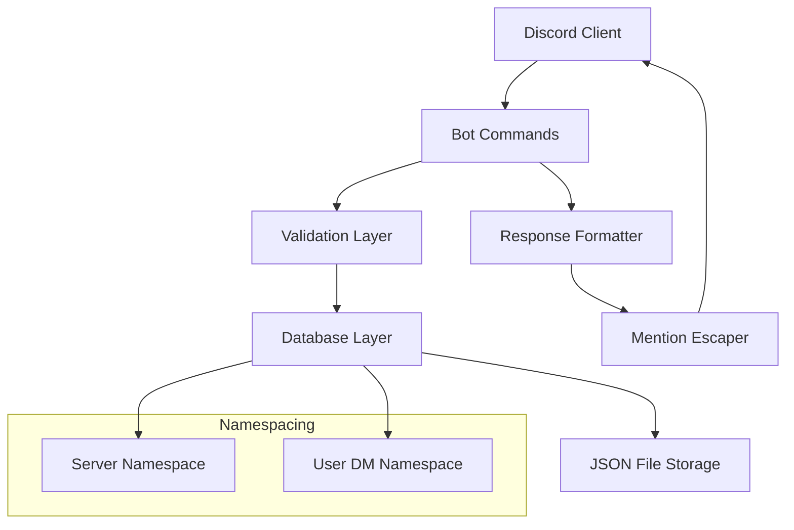

# Design Document

## Overview

This design extends the existing Discord bot to implement the specific memory system requirements with `remember` and `where` commands. The bot will maintain separate namespaces for different Discord servers and individual users in DMs, with proper validation, error handling, and mention escaping.

The design builds upon the existing architecture using the `typed_json_db` library and Discord.py framework, enhancing the current `RememberEntry` model and database operations to meet the new requirements.

## Architecture

### High-Level Architecture



### Component Interaction

The bot follows a layered architecture:

1. **Command Layer**: Handles Discord command parsing and routing
2. **Validation Layer**: Validates aliases and content according to requirements
3. **Database Layer**: Manages data persistence with namespace isolation
4. **Response Layer**: Formats responses and escapes mentions

## Components and Interfaces

### Command Interface

```python
@bot.command()
async def remember(ctx: commands.Context, alias: str, *, content: str) -> None:
    """Store content with an alias in the appropriate namespace"""


@bot.command()
async def learn(ctx: commands.Context, alias: str, *, content: str) -> None:
    """Alias for remember command - store content with an alias"""


@bot.command()
async def where(ctx: commands.Context, alias: str) -> None:
    """Retrieve content by alias from the appropriate namespace"""


@bot.command()
async def find(ctx: commands.Context, alias: str) -> None:
    """Alias for where command - retrieve content by alias"""
```

### Validation Component

```python
class AliasValidator:
    @staticmethod
    def validate_alias(alias: str) -> tuple[bool, str]:
        """Validate alias format and length"""

    @staticmethod
    def validate_content(content: str) -> tuple[bool, str]:
        """Validate content length and emptiness"""
```

### Database Enhancement

The existing `DB` class will be enhanced to support:

- Case-insensitive alias matching
- Improved namespace isolation
- Better error handling

```python
class DB:
    def remember_store(
        self, server_id: Optional[int], user_id: int, alias: str, content: str
    ) -> bool:
        """Store content with proper namespace handling"""

    def remember_retrieve(
        self, server_id: Optional[int], user_id: int, alias: str
    ) -> Optional[str]:
        """Retrieve content with case-insensitive matching"""
```

### Response Formatter

```python
class ResponseFormatter:
    @staticmethod
    def escape_mentions(text: str) -> str:
        """Escape Discord mentions in text"""

    @staticmethod
    def format_not_found_message(alias: str) -> str:
        """Format helpful error message for missing aliases"""
```

## Data Models

### Enhanced RememberEntry

The existing `RememberEntry` dataclass will be used with enhanced validation:

```python
@dataclass
class RememberEntry:
    id: uuid.UUID
    server_id: Optional[int]  # None for DMs
    user_id: int
    created_at: str
    name: str  # Case-insensitive storage (lowercase)
    content: str
```

### Namespace Strategy

- **Server Namespace**: `server_id` + `name` (case-insensitive)
- **User DM Namespace**: `server_id=None` + `user_id` + `name` (case-insensitive)

## Error Handling

### Validation Errors

1. **Empty Content**: "Content cannot be empty. Use `.remember [alias] [text]` to store something."
2. **Content Too Long**: "Content too long (max 1000 characters). Current length: {length}"
3. **Alias Too Long**: "Alias too long (max 100 characters). Current length: {length}"
4. **Invalid Alias Characters**: "Alias contains invalid characters. Use only letters, numbers, underscores, dashes, dots, and slashes."

### Retrieval Errors

1. **Alias Not Found**: "Alias not found. Use `.remember [alias] [text]` to create an alias."

### System Errors

- Database connection failures
- File system errors
- Discord API errors

All errors will be logged and user-friendly messages will be sent to Discord.

## Testing Strategy

All tests will be written using pytest and stored in the `tests/` directory.

### Unit Tests

1. **Validation Tests** (`tests/test_validation.py`)
   - Test alias format validation
   - Test content length validation
   - Test edge cases (empty strings, boundary lengths)

2. **Database Tests** (`tests/test_database.py`)
   - Test namespace isolation
   - Test case-insensitive matching
   - Test data persistence

3. **Response Formatting Tests** (`tests/test_response_formatter.py`)
   - Test mention escaping
   - Test error message formatting

### Integration Tests

1. **Command Tests** (`tests/test_commands.py`)
   - Test remember/learn commands in server context
   - Test remember/learn commands in DM context
   - Test where/find commands with existing/non-existing aliases
   - Test command aliases work identically
   - Test namespace isolation between servers and users

2. **End-to-End Tests** (`tests/test_integration.py`)
   - Test complete remember/where workflow
   - Test complete learn/find workflow
   - Test bot restart persistence
   - Test concurrent access scenarios

### Test Data

- Valid aliases: "test", "my_alias", "config.json", "path/to/file"
- Invalid aliases: "", "a" * 101, "alias with spaces"
- Valid content: "Hello world", "x" * 1000
- Invalid content: "", "x" * 1001

## Implementation Notes

### Case-Insensitive Matching

Aliases will be stored in lowercase in the database but displayed in their original case in responses. The search will always convert input to lowercase for matching.

### Mention Escaping

Discord.py provides `discord.utils.escape_mentions()` function which will be used to escape all mentions in retrieved content before sending responses.

### Database Queries

The existing `typed_json_db` library supports filtering, so queries will use:

- `server_id` and `name.lower()` for server context
- `server_id=None`, `user_id`, and `name.lower()` for DM context

### Performance Considerations

- In-memory caching is not required for the initial implementation
- JSON file storage is sufficient for moderate usage
- Database queries are filtered to minimize search space

### Migration Strategy

The existing database schema is compatible with the new requirements. No migration is needed as the current `RememberEntry` structure supports all required fields.
