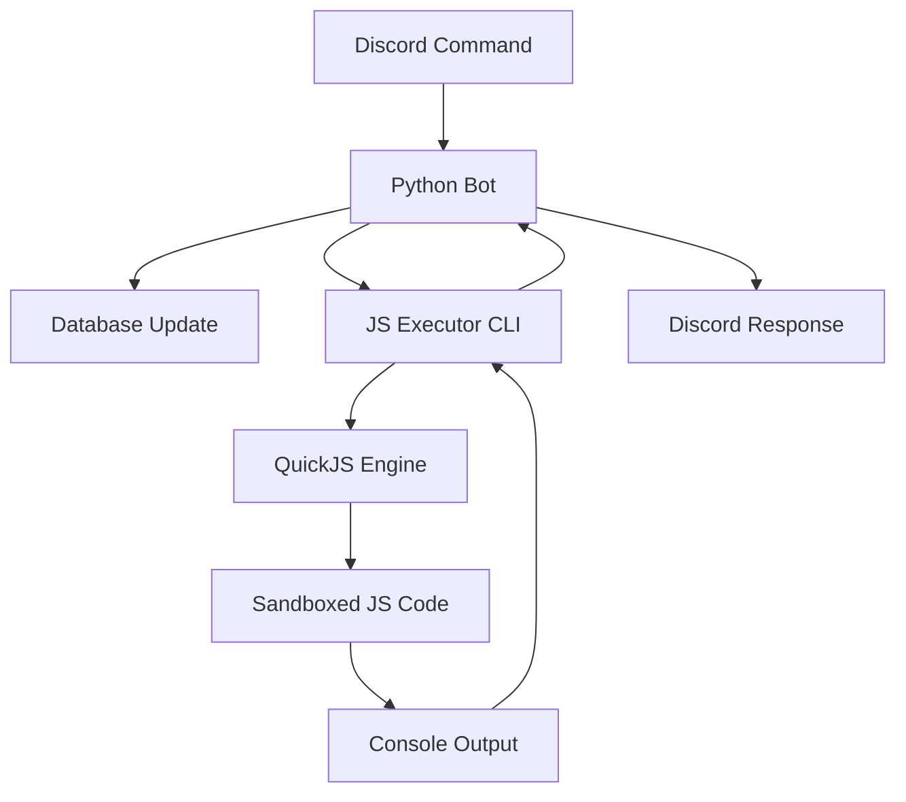

# Design Document

## Overview

This design implements JavaScript execution capabilities for memory bot entries through a Deno-based CLI tool using quickjs-emscripten. The system consists of three main components: database schema updates, a Deno CLI executor, and Python integration code.

## Architecture



## Components and Interfaces

### 1. Database Schema Updates

**Entry Model Extension:**
```python
@dataclass
class Entry:
    # ... existing fields ...
    run: Optional[str] = None  # JavaScript code to execute
```

**New Command Handler:**
```python
async def handle_set_run_command(
    message: discord.Message, 
    alias: str, 
    js_code: str
) -> None:
    """Handle .set <alias> .run <code> commands"""
```

### 2. Deno CLI JavaScript Executor

**File:** `js-executor/main.ts`

**Interface:**
```typescript
interface ExecutionContext {
    content: string;      // Original entry content
    name: string;         // Entry name
    created_at: string;   // Entry creation timestamp
    user_id: number;      // Entry creator ID
}

interface ExecutionResult {
    success: boolean;
    output: string;       // Console.log output
    error?: string;       // Error message if failed
}
```

**CLI Usage:**
```bash
deno run --allow-read js-executor/main.ts <js-code> <context-json>
```

### 3. Python Integration

**JavaScript Executor Service:**
```python
class JavaScriptExecutor:
    def __init__(self, timeout: float = 1.0):
        self.timeout = timeout
        self.deno_path = "deno"
        self.executor_script = "js-executor/main.ts"
    
    async def execute(self, code: str, context: dict) -> tuple[bool, str]:
        """Execute JavaScript code with context"""
```

## Data Models

### Updated Entry Schema

```python
@dataclass
class Entry:
    id: uuid.UUID
    server_id: Optional[int]
    user_id: int
    created_at: str
    name: str
    content: str
    promoted: bool
    run: Optional[str] = None  # New field for JavaScript code
```

### JavaScript Context Object

The JavaScript code will have access to a global `context` object:

```javascript
// Available in JavaScript execution environment
const context = {
    content: "Original entry content",
    name: "entry-name",
    created_at: "2025-01-29T...",
    user_id: 12345
};

// Example usage
console.log(`Entry "${context.name}" contains: ${context.content}`);
```

## Error Handling

### JavaScript Execution Errors

1. **Timeout Errors:** Code execution exceeding 1 second
2. **Memory Errors:** Code consuming excessive memory
3. **Syntax Errors:** Invalid JavaScript syntax
4. **Runtime Errors:** Exceptions during execution

### Error Response Format

```python
class JSExecutionError(Exception):
    def __init__(self, error_type: str, message: str):
        self.error_type = error_type  # "timeout", "memory", "syntax", "runtime"
        self.message = message
```

### Fallback Behavior

When JavaScript execution fails:
1. Log the error for debugging
2. Display trimmed error message to user (respecting Discord message limits)
3. Show original entry content as fallback

## Testing Strategy

### Unit Tests

1. **Code Parsing Tests:** Verify triple backtick stripping from JavaScript code
2. **Context Generation Tests:** Ensure proper context object creation from Entry data
3. **String Output Tests:** Compare expected console.log output with actual results

### Test JavaScript Examples

```javascript
// Simple output test
console.log("Hello from " + context.name);

// Context access test  
console.log(`Created at: ${context.created_at}`);
console.log(`Original content: ${context.content}`);

// Multiple console.log calls
console.log("Line 1");
console.log("Line 2");
console.log("Line 3");
```

## Security Considerations

### Sandboxing

1. **No File System Access:** JavaScript cannot read/write files
2. **No Network Access:** No HTTP requests or external connections
3. **No Process Access:** Cannot spawn processes or access system APIs
4. **Memory Limits:** Strict memory allocation limits
5. **Time Limits:** 1-second execution timeout

### Input Validation

1. **Code Size Limits:** Reasonable limits on JavaScript code length
2. **Context Sanitization:** Ensure context data is properly escaped
3. **Output Sanitization:** Trim and validate console output

## Deployment Configuration

### nixpacks.toml Updates

```toml
[phases.setup]
nixPkgs = ["...", "sops", "age", "deno"]

[phases.build]
cmds = ["cd js-executor && deno cache main.ts"]
```

### File Structure

```
js-executor/
├── main.ts              # Main Deno CLI script
├── executor.ts          # QuickJS wrapper
├── context.ts           # Context type definitions
└── deno.json           # Deno configuration
```

